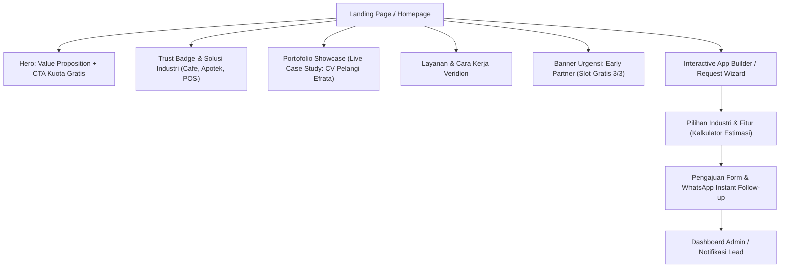
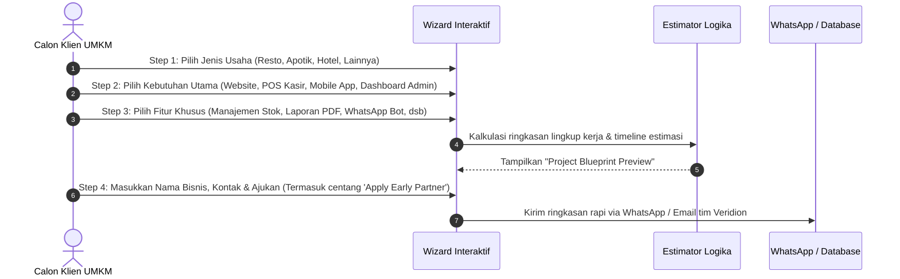

# Blueprint Platform Veridion Studio: Company Profile & Interactive App Request System

Dokumen ini merancang strategi platform web untuk **Veridion Studio** — menggabungkan *kredibilitas brand agency*, *showcase portofolio nyata*, promosi eksklusif **"Early Adopter Program: Gratis 3 Klien Pertama"**, serta **Sistem Pengajuan Aplikasi Interaktif (App Request Wizard)**.

---

## 1. Value Proposition & Positioning Brand

* **Nama Studio**: **Veridion Studio**
* **Target Pasar**: UMKM, Cafe/Resto, Apotek/Klinik, Perhotelan/Villa, Retail & Servis Lokal.
* **Core Pain Point Klien**:
  * UMKM sering menganggap software custom itu mahal, ribet, dan lama.
  * Banyak agency hanya memberikan portofolio "mockup/konsep fiktif" yang tidak terbukti di lapangan.
* **Unique Value Proposition (UVP)**:
  > *"Software House Solutif untuk Bisnis Berkembang — Membangun Ekosistem Digital Nyata (POS, Sistem Operasional, Web) yang Langsung Menghasilkan Impact."*
* **The "Zero-Risk Hook" (Penawaran 3 Klien Pertama)**:
  * **"Veridion Early Partner Program (Kuota 3/3 Tersedia)"**
  * *Bukan sekadar gratis*, tapi diposisikan sebagai **Strategic Partnership Pilot**. Klien mendapat pengerjaan sistem inti/web gratis dengan syarat: menjadi studi kasus resmi, testimoni video/surat kepuasan, dan feedback iteratif.

---

## 2. Struktur Arsitektur Halaman (Sitemap & Alur Pengguna)

---

## 3. Rincian Section Landing Page (Company Profile)

### A. Hero Section
* **Headline**: *"Transformasi Bisnis Anda dengan Software Custom yang Tepat Sasaran & Berkinerja Tinggi."*
* **Subheadline**: *"Mulai dari Sistem Kasir (POS) Cafe/Resto, Manajemen Apotek, hingga Website Bisnis. Solusi scalable, cepat, dan disesuaikan langsung dengan SOP bisnis Anda."*
* **Call-to-Action (CTA)**:
  1. Primary: **"Klaim Slot Early Partner (Gratis 3 Klien Pertama)"** *(Badge berdenyut: Sisa 3 Slot)*
  2. Secondary: **"Hitung Kebutuhan App Anda (Kalkulator Interaktif)"**

### B. Live Case Study Showcase (CV Pelangi Efrata)
*Bukan sekadar mockup screenshot, tampilkan metrik dan implementasi nyata:*
* **Kategori**: Enterprise Web & POS System
* **Masalah Klien**: Pencatatan penjualan terfragmentasi, butuh pelaporan stok real-time dan rekap transaksi cepat.
* **Solusi Veridion**:
  * POS kasir responsif & offline-ready capability.
  * Web Company Profile profesional untuk kredibilitas B2B.
  * Dashboard laporan harian & analitik omzet.
* **Preview Visual**: Tab interaktif (Tampilan POS Kasir + Tampilan Company Profile).
* **Impact Badge**: *"Aktif digunakan secara operasional harian."*

### C. Solusi Berdasarkan Sektor Industri
Klien UMKM suka melihat industri mereka disebut secara spesifik:
1. **Cafe & Resto**: Smart POS, Menu Digital QR, Manajemen Meja, Rekap Bahan Baku.
2. **Apotik & Klinik**: Tracking Stok Obat & Expired Date, Resep Digital, Laporan Transaksi Apotek.
3. **Perhotelan & Penginapan**: Booking Engine Sederhana, Room Availability Tracker, Guest Invoice.
4. **UMKM Retail / Servis**: Katalog Online, WhatsApp Order Generator, Mini CRM Pelanggan.

### D. Mekanisme "3 Klien Pertama Gratis" (Early Partner Program)
Agar tidak terlihat murahan (*cheap*), framing program ini dengan standar profesional:
* **Apa yang Gratis?**: Development fee untuk MVP (Landing page bisnis, POS basic, atau Sistem Manajemen Sederhana).
* **Apa yang Klien Siapkan?**: Biaya pihak ketiga seperti domain/hosting (jika ingin pakai nama sendiri) atau API khusus.
* **Kriteria Seleksi**: Bisnis yang sudah aktif beroperasi & siap diinterview untuk studi kasus.
* **Progress Bar Slot**: `[● Tersedia] [● Tersedia] [● Tersedia]` (Otomatis bisa diupdate jika slot terisi).

---

## 4. Fitur Unggulan: Interactive App Request Wizard (Preferensi Klien)

Fitur ini membuat pengunjung merasa sedang merancang aplikasi mereka sendiri dalam 4 langkah mudah:

### Data Spesifikasi Form Request:
* **Nama Bisnis & Lokasi**
* **Sektor Bisnis** (Cafe / Resto / Apotik / Hospitality / Retail)
* **Kategori Solusi**:
  * Company Profile / Website Portofolio
  * Point of Sales (POS) Kasir
  * Sistem Inventori & Gudang
  * Sistem Booking / Reservasi
  * Custom Web App / Dashboard Khusus
* **Preferensi Platform**: Web (Desktop & Mobile Responsive), Android App, atau PWA (Installable Web).
* **Timeline yang Diharapkan**: Segera (1-2 minggu), Standar (1 bulan), Fleksibel.
* **Opsi Apply**: *"Daftarkan saya untuk program 3 Klien Gratis Pertama (Early Partner)"*.

---

## 5. Rekomendasi Tech Stack

| Layer | Rekomendasi | Alasan |
| :--- | :--- | :--- |
| **Framework** | **Next.js 14+ (App Router)** atau **Vite + React** | Performa SEO tinggi untuk company profile, SSR cepat, animasi mulus. |
| **Styling** | **Tailwind CSS + Lucide Icons + Framer Motion** | Tampilan modern bernuansa *tech-agency*, sleek dark/light mode, micro-interactions mewah. |
| **Form & State** | **React Hook Form + Zod** | Validasi wizard app request multi-step yang presisi. |
| **Database & Lead Capture** | **Supabase (PostgreSQL)** atau **Prisma** | Simpan pengajuan aplikasi klien, kuota slot 3 klien gratis dinamis, notifikasi webhook. |
| **Instant Action** | **WhatsApp Direct Link Integration** | Mayoritas pemilik UMKM lokal di Indonesia menyukai respons cepat via WhatsApp. |

---

## 6. Rencana Tahapan Implementasi

1. **Fase 1: Setup Proyek & Identitas Visual Veridion**
   * Desain logo, palet warna (*Modern Emerald/Cyan on Dark Slate* — melambangkan teknologi modern & pertumbuhan bisnis).
2. **Fase 2: Pembuatan Landing Page & Showcase Portofolio**
   * Implementasi Hero, Solusi Industri, dan Showcase mendalam **CV Pelangi Efrata (POS & Web)**.
3. **Fase 3: Pembuatan Multi-Step App Request Wizard**
   * Komponen interaktif pemilihan modul sistem bisnis + auto-generate ringkasan spesifikasi.
4. **Fase 4: Sistem Manajemen Slot Promo (3 Klien Pertama)**
   * Banner status kuota real-time dan mekanisme integrasi direct WhatsApp / DB backend.
5. **Fase 5: Testing & Deployment**
   * Audit performa CWV (LCP/INP), SEO metadata, dan deployment ke Vercel/Netlify.

